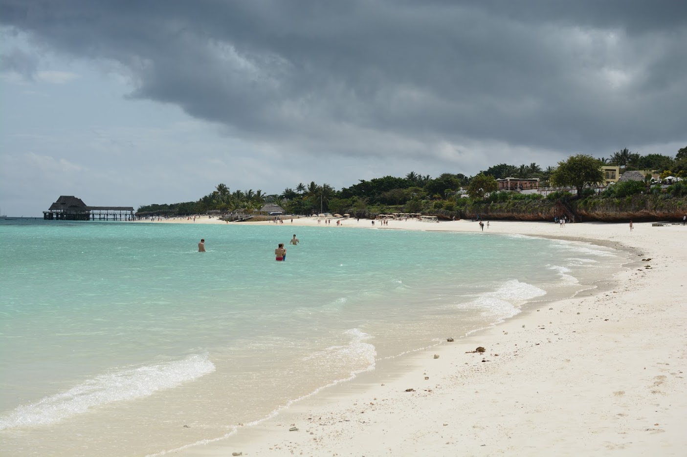
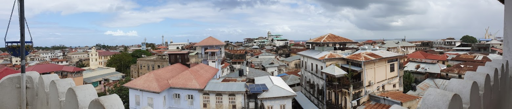
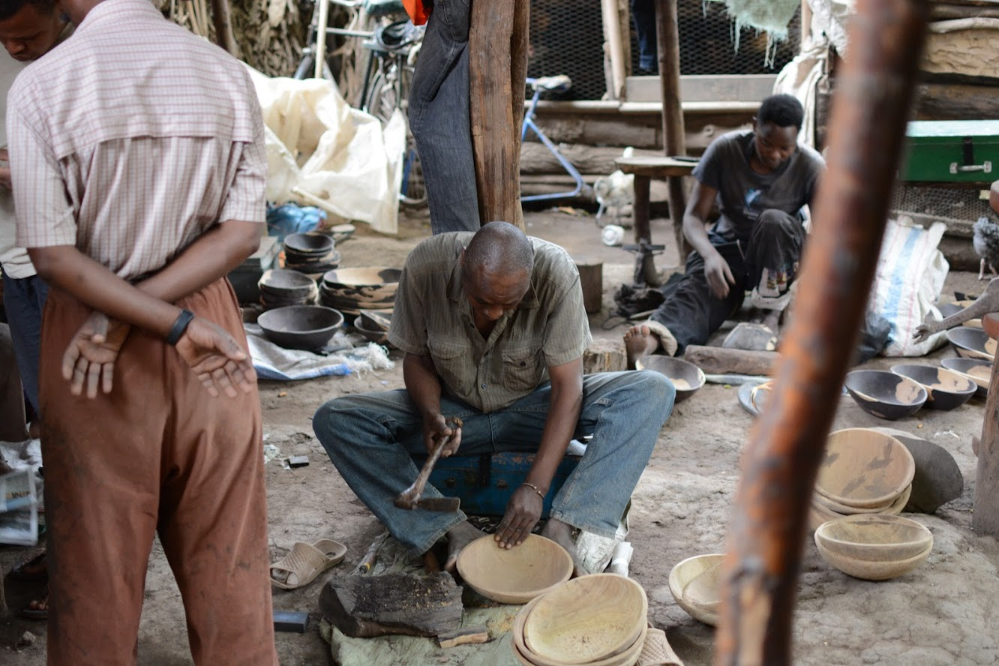
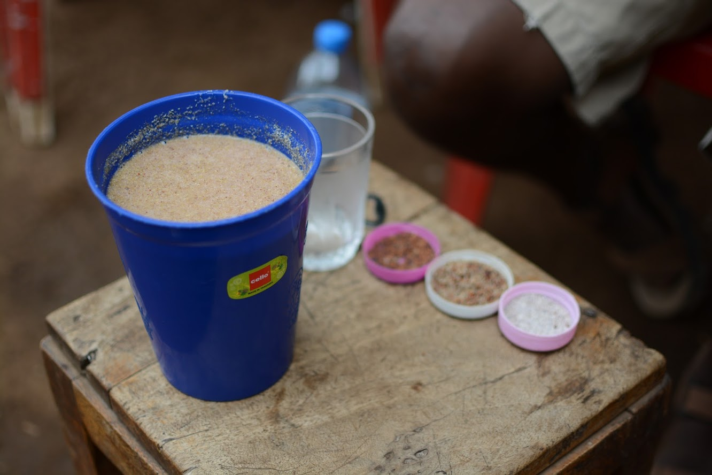
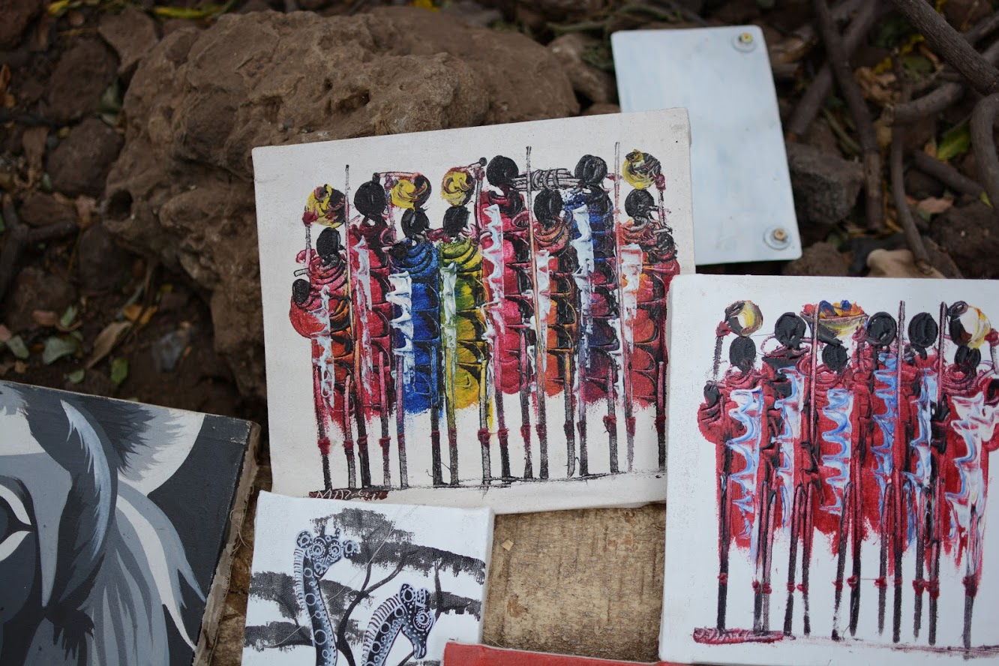
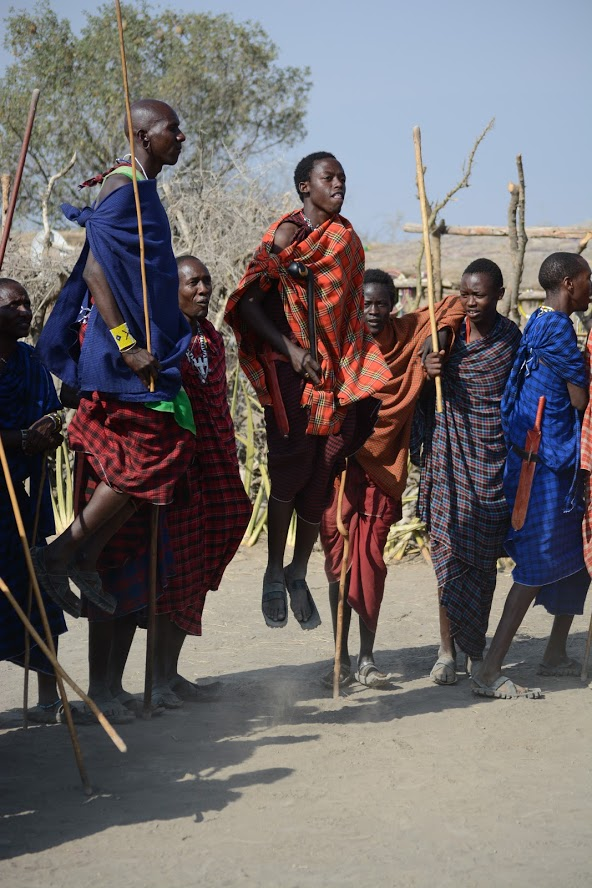
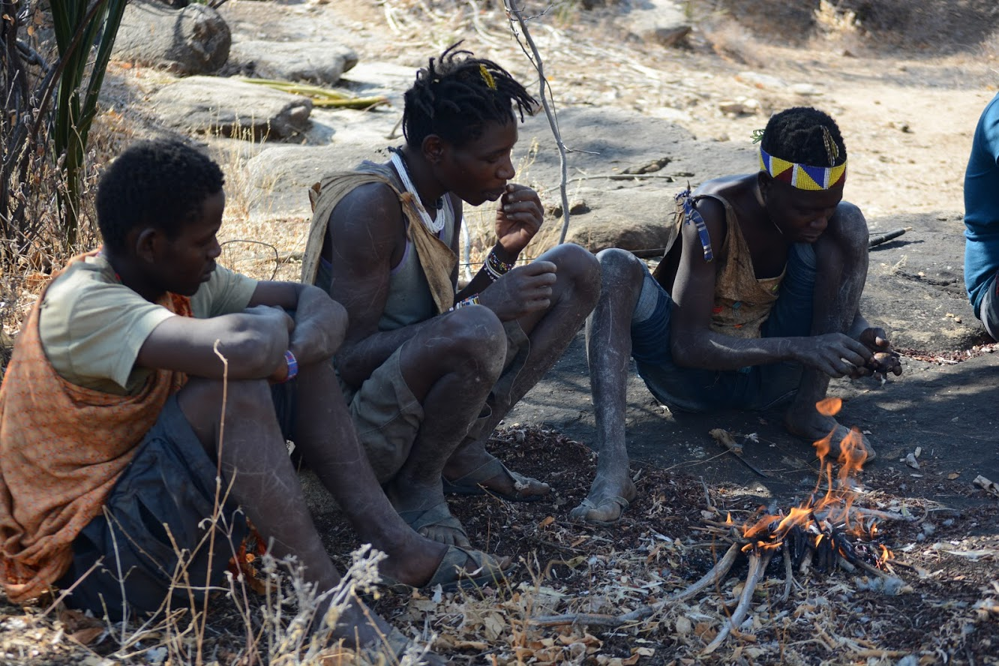
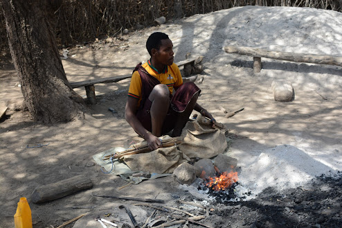
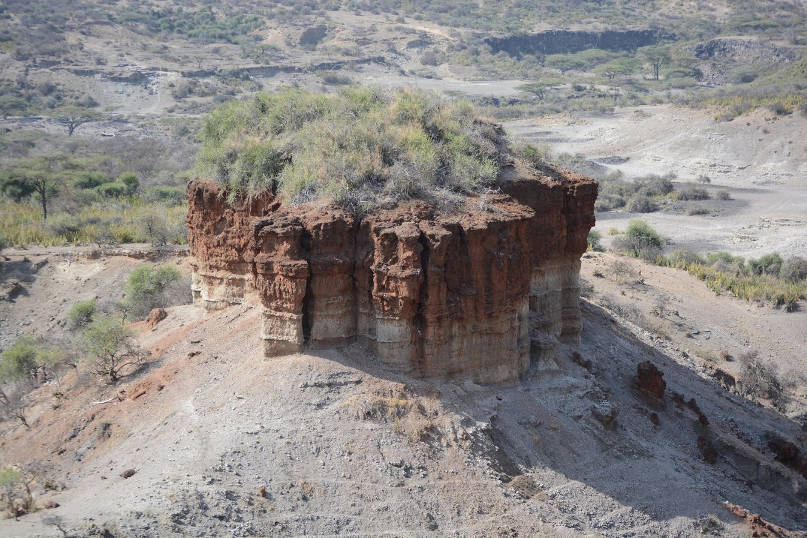

# Other things to see/do in Tanzania

The most obvious one is **beach in Zanzibar**. We stayed in Kendwa, upnorth (a calm beach near the most touristy one, Nungwi). The water is good, though not as good as in Thailand for instance (or it was just a bad year…). The temperature was around 24-25 ºC. The beach itself is very good. We were just unfortunate to have rain falling down on us almost everyday. It wouldn’t last very long but the sky was seldom clear. But obviously it’s not always like that, we were just unlucky (even though we were there in the beginning of August, which is already the start of the dry season).

But don’t get fooled, there are other things to do in Tanzania.
Still in Zanzibar you can visit **the famous spice farms**. We didn’t go so I can’t really say anything about them but if I had to bet and I’d say it is really worth it. The only reason we didn’t go was the amount of days. We only had 3 full beach days and we didn’t want to spend one of them doing something else.

And you have **Stone Town, a UNESCO patrimony**. This is the old town in the Zanzibar city, the “capital” of the island). It’s very beautiful and you can easily roam its streets without any boredom. We ended up doing a walking tour with one of the guides that are there. The price he gave us (45 USD for both of us) and lower than any of the prices available online and it was a really great tour (a bit more than 2 hours).

In the continent, there are also some cities to visit. We visited Arusha and Dar Es Salaam, 1 day in each. Honestly, **Arusha** doesn’t have much to see. There is a national history museum, which is small but interesting and a clock tower that is smaller than a two story house. What we really disliked about Arusha was that we couldn’t just be, there was always someone talking with us trying to sell something. Even if we’d say “No, thank you” and just kept walking, they would stick with us for over 15 or 20 minutes just talking about anything. Only at the end would they actually try to sell something (we never bought anything).

On the other hand, **Dar Es Salaam** has more to see. We did a 3 hours walking tour that we booked in our hotel’s reception (20 USD) and it was very good. Check out [Safari Unique Ltd](https://www.tripadvisor.com/Attraction_Review-g293748-d12975598-Reviews-Safari_Unique_Ltd-Dar_es_Salaam_Dar_Es_Salaam_Region.html) and ask for Sylvester, we had a great time with him.

During our Safari we also visited some **local tribes**. **Tanzania has 120 different tribes**, which with their own craft. Some of the tribes we met in Mto Wa Mbu. There is a community there that helps people living the best they can, and has a school for the children. Everyone lives to help each other and to make sure the next generations have better lives. Here we met people from the Makonde and Chaga tribes.

The **Makonde tribe** is originally from Mozambique (their parents spoke portuguese, the new generations don’t anymore) and they moved to Tanzania during the civil war in Mozambique. Their craft is wood carving.

The **Chaga tribe** is from Mount Kilimanjaro and their people live all around the country. With them we tried banana beer, which is used as conversations/negotiations drink. When people in conflict get together and drink it it means they are ready to talk to each other.

We also met a **Ujamaa**, which, in Swahili, means extended family, brotherhood or socialism; as a political concept it asserts that a person becomes a person through the people or community. In this one their craft was painting, with different techniques.

All of these tribes share knowledge and teach their kids some sort of craft, while putting them through school. It was great witnessing such a community. Here we also visited a **banana farm** and learned about the different types of bananas (some of which I didn’t even know existed) and how to grow them.

We also met three more tribes in other places. There are tons of **Maasai villages** around the area (the land mostly belongs to them) and we visited one of them. This was the most touristy of all the tribes we visited. They charged an entry fee, the school classroom had a charity box and the souvenirs were really expensive (they asked for 30 USD for a bead bracelet, the price is always negotiable, but still). However we were able to learn about their way of living and know some of their traditions, which was really interesting. In the picture they are having a jumping competition.

We also met two other tribes, near Lake Easi, that had absolutely nothing to do with this one.
One of them, the **Hadzabe tribe**, are hunters and gatherers. You read it correctly, hunters. They live on what they can hunt and on which roots they can gather. They shower when it rains, they never see a doctor (except for the healer) and their children start learning how to hunt when they are 3. Their dialect is really strange and hard to learn as they have a clicky sound which can’t be translated in writing. There are around 800 people of this tribe and each village usually has 2 or 3 families. One thing that set this tribe apart was that they were monogamous. In the picture they are roasting (and eating of course) a bird they caught when they took us in one of their hunting parties.

The last tribe we visited (also near Lake Easi) was the **Datoga tribe**. They are blacksmiths. This one was specially interested because the locals were also very interested in our culture and in our way of living, namely regarding marriage habits and our relationship with our parents after we get married. It was really great (and actually inspiring) to have such an exchange with them.

In these last two tribes none of them spoke English nor Swahili so we had a guide with us (different from the Safari guide even though this was included in the Safari pack) that spoke each of their dialects as well as English and Swahili (and who knows what else).

Finally, we also visited the **Olduvai Gorge** (the original name was Oldupai Gorge but that was registered as Olduvai due to an error of the first explorer to write it down). This is the place where the most ancient human fossil was discovered and thus is considered to be the birth of humanity. It has a really nice museum and a very good lecture about the history of the place, which is done while we overlook the actual Olduvai Gorge, which we can see in the picture. The entry fee is about 35 USD per person and an authorization must be requested prior to arrival (our guide requested it in the morning and we went there in the afternoon).

