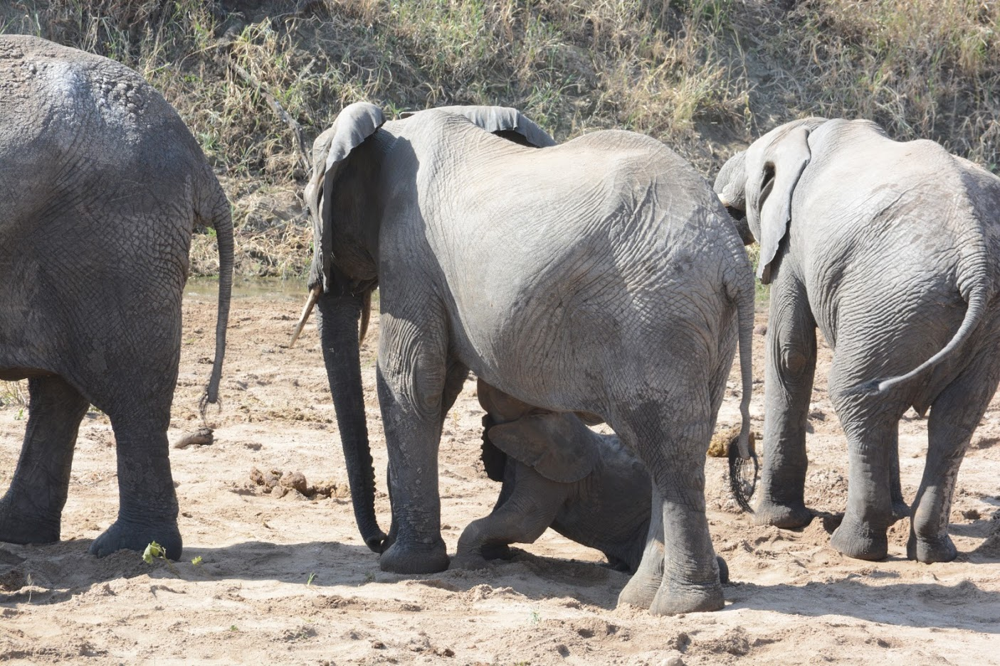
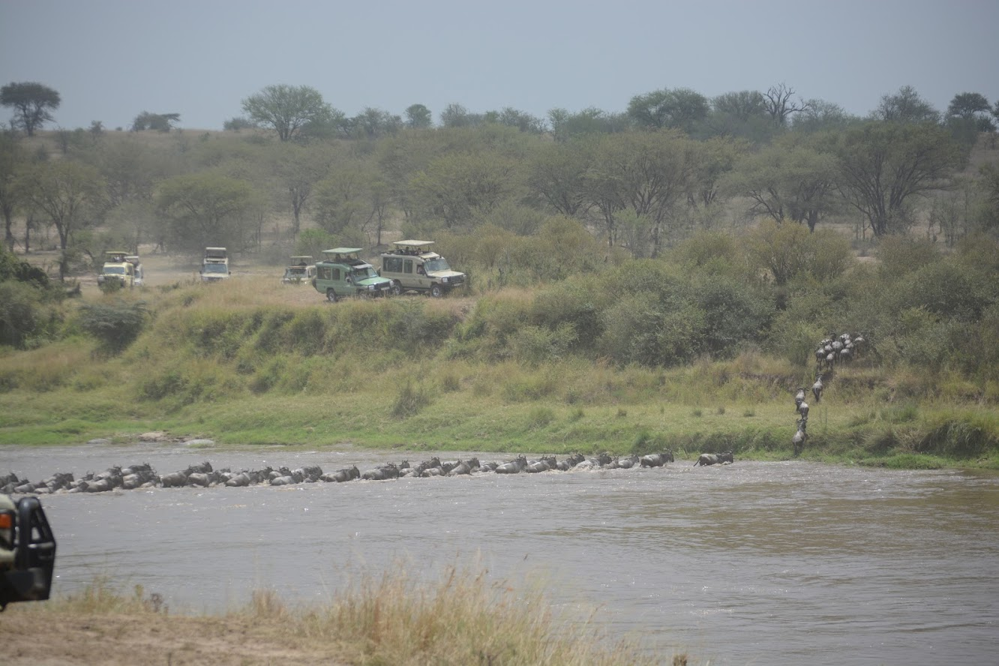
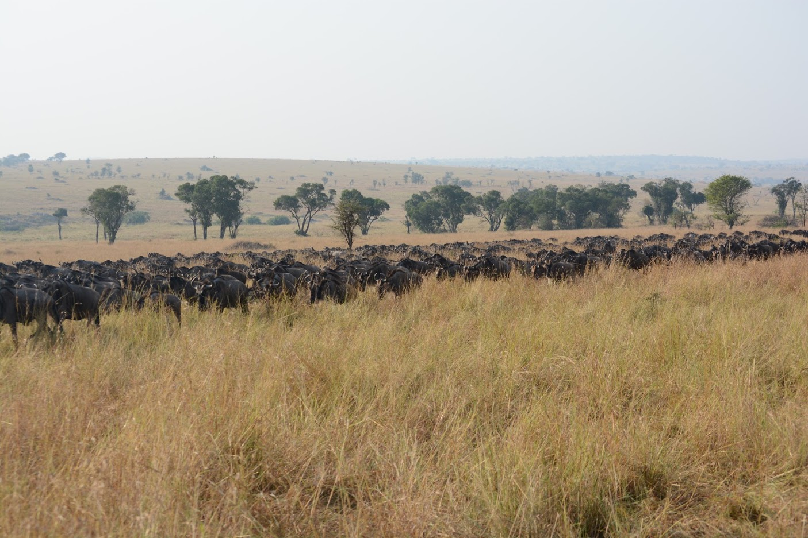
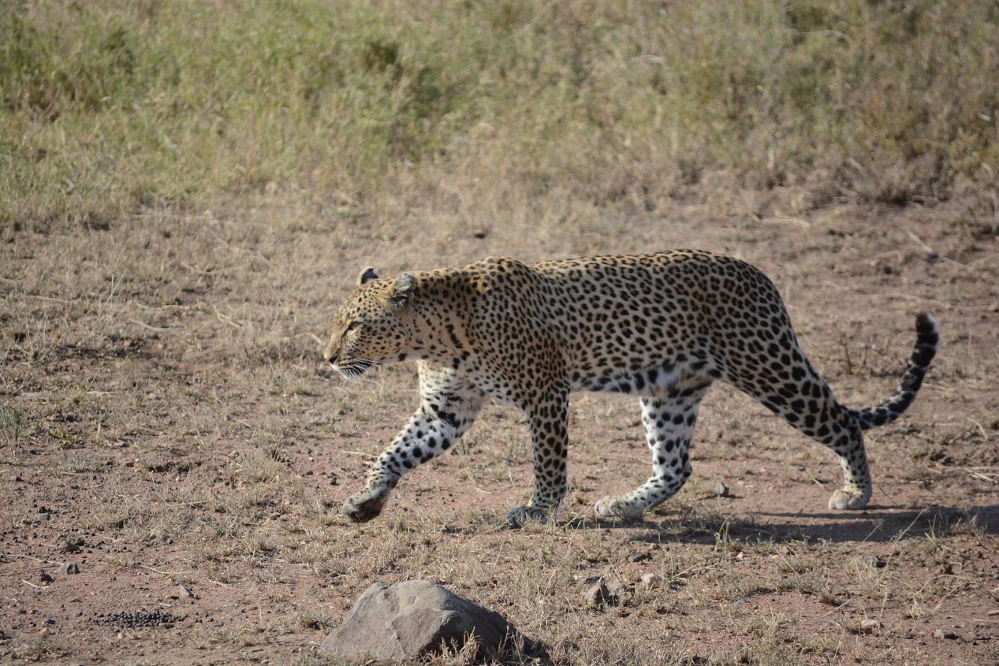

# Your First Safari - How To

In 2019, my boyfriend and I went on a Safari to Tanzania. We were excited and, at the same time, afraid it wouldn’t match our expectations (our previous and first major travel was a huge success). But I can honestly say it did :) We booked with [Roam Serengeti Safaris](https://www.safaribookings.com/p3237) and couldn't have asked for anyone better.

Apart from animal sighting there are other things you can do/see in Tanzania. Some of them were included in our Safari, some were extra. If you want to know more [check this page](./07-09-2019-Other_Things_In_Tanzania.md.html).

## How long to go

We went on a 9 days Safari, including some cultural days in which we got to meet a few of the 120 tribes currently existing in Tanzania. These 9 days didn’t include arrival nor departure days. I think it was the perfect amount of time (of course this depends on what you want to see and where you want to go).
After we spent 4 days on the beach in Zanzibar and 2 days in the city: one in Stone Town, Zanzibar and one in Dar Es Salaam.

## When to go
We went on the end of July because it’s when the Great Migration is crossing towards Kenya and we wanted to try and see one of the famous river crossings (which we did as I’ve said before). More, it’s the beginning of the dry season, so the chances of rain are slim and it won’t be too hot.
Going in January or February is great if you want to witness the calving season. It’s also allegedly easier to see some hunting.
All around the year you’ll see the different animals. What you need to decide is which phase of the Great Migration you want to witness, as all other animals will be the same :D Except for the Rhino (the only one we didn’t get to see), that is easier to spot in the hot, rainy season.
March, April and May are the only months in which it’s not advisable to visit the north of Tanzania (where all the parks I mentioned are) as some of the roads within the parks will be closed because of the rain.

## Private or Group tour
We opted for a private tour and I honestly think it’s the best option. It enables you to personalise the tour to your preferences (with corresponding prices updates, of course), you can spend as much or as little at each spot as you want.
One thing that’s worth noticing is that it’s really not that cheaper to go on a group tour. Ask for quotes and check it by yourself.
I would totally advise against going on a group tour that takes place in a bus. We saw some of these and there wasn’t even an open window for each person. A pop-up jeep or a pop-out walls one (don’t know the actual name, but the car’s sides are removable) are the best ones. They give you more visibility and you will need that visibility.

_**Is it really that important to have independence from strangers while in Safari?**_

I honestly think so. For instance, we spent 3 hours waiting in the car to see a river crossing, we spent 2 hours looking at a leopard on a tree waiting to see if it would get up and eat the prey it had previously caught and that was laying in a nearby branch and we spent some time looking at an impasse situation: a buffalo in a pond surrounded by lions, the lions didn’t want to go in the water, the buffalo couldn’t get out of it without getting attacked. In other cases we would just move. For instance, after seeing tons of zebras you don’t need to stop every time you see more zebras. Nevertheless, sometimes they were in some weird positions and we would stop to take a picture. All of this flexibility is only possible because we weren’t in a bigger group, in which you have to deal with strangers preferences. Moreover, you’re always more at ease when you’re with people you know and whose habits you already know. However, the more the cheaper per person. So if you can take friends or family with you (max 7 people) it will get cheaper.

## How expensive it is
The best advice I can give is “ask for quotes” and “ask for quotes”. You will find all sorts of prices. But don’t be fooled, it is expensive. Of course the more days you go the more expensive it will get. But I can tell you I got quotes, for the same amount of days, that were twice as much as others. There are some differences between them that justify a bit of the difference, such as the type of accommodations where you stay or the state of the vehicle (we saw some that were clearly newer and with seats more comfortable than ours). Other than that, the quality of the guide is the most important aspect of the Safari and that has no correlation to the price. **These are all prices for two people.**

**Safari itself** (9 days with all meals and accommodations included): 5000€ (2500€ p.p.)

Meals on the day before and dinner on the last day: 27€

Accommodation before and after: 62€

Tips: 24€ + 200€ for the guide

Shuttle to/from airport: 60€

Flights to/from Portugal (Porto): 1856.84€ (928.42€ p.p.)

Don’t forget to verify what is included in the pack you’re paying. All our meals were included during the Safari but not the drinks. We only drank like a juice and a beer per day so it wasn’t a hit on the budget. But if you drink wine or several beers watch out.

## Tipping
Regardless of whether you’re used to tip, you should at least tip your driver. The price you pay doesn’t include their salary, they only receive an allowance per day. I don’t agree with this way of working but it won’t be me, a foreigner, to tell them how I think that’s wrong. The tip suggested by our tour operator was about 10 USD per day per person.
Other than that, we tipped a few times but every time it felt like they weren’t expecting it, it was a bit awkward so we just stopped doing it (we were only doing it because we thought they expected it and because there is high a discrepancy between our life cost and theirs (we never tip in Portugal, in fact most portuguese people don’t in case you were wondering).

## How to book
We mostly used Safari Bookings and Trip Advisor. Safari Bookings is a huge help. It enables search by country and by park to visit and it presents an estimate of the amount you’ll be paying for the dates you define.
Our process was:
1. Define the country
    1. Look online for the best countries for a Safari we settled with Tanzania and/or Kenya)
1. Define what we absolutely had to visit
    1. Check several tours (both from Safari Booking or randomly found online) regardless of their price
    1. Check the parks they suggested
    1. Search online information about those parks
    1. Define our priorities (we settled for Ngorongoro and North Serenget for the river migration in Tanzania and Masai Mara in Kenya)
1. Check the best time to do it
    1. In our case for the migration this was late July
1. Search Safari Bookings using these filters
1. Make a document with all the tour operators that matched the filters
    1. Get the review score (and number of reviews) for each of them from both Safari Bookings and Trip Advisore
    1. Filter out all that didn’t met our minimum requirements (low score or too little reviews)
    1. *This was a bit hardocore as there are really a ton*
1. Select the top ones
1. Check the tours they offered (we can even get an idea of the price without asking for a quote in Safari Bookings)
1. Ask for quotes for the tours in which we were interested
1. Make a document with the ones that made it until here with what would be done in each day
1. Compare them and make a final decision

AFAIK, the reviews on Safari Bookings can be trusted. At least as much as the ones in Trip Advisor.

## Which parks to visit
I can advocate for the ones we visited: We started with two days in Tarangire, where we got to see a bit of everything, which is great considering it was our first time. Special notice to the elephants. So many and of varying sizes. We got to see some really small ones who were around 3 or 4 months. It was great. 

Next we visited Serengeti, which means endless plains. It’s easy to understand why if you look at this 180º picture (the other 180º were the same).

The park is not like this all around but it was definitely a shock compared to Tarangire, which had a lot more vegetation and trees. We stayed here for four days. First we visited the North, where we got to see one of the famous river crossings and wildebeest that would go in line for miles. Once we drove for a few minutes and the line of wildebeests just kept going and going.

We also visited Central Serengeti, which is mostly famous for the sheer amount of predators. We saw lions and leopards up close and cheetahs in the far distance.
And when I say up close…
This photo has absolutely no zoom.

And in this one you can clearly see the car that was next to ours. This one is actually a finding. It’s hard to spot leopards as they’re usually up in the trees (we got to see one as well by the way) but it’s really rare to see one on the ground as they only get out of the trees to go hunting or to go to another tree (which was the case here).

The last park we visited was the Ngorongoro crater. If you only have one day to go on Safari this is the place to go (our Safari guide said so as well). Why? Because you can see a bit of (almost) every animal there and wherever you are standing in the crater you will be able to spot more than one species. For instance, as soon as we got to the bottom of the crater we could see, in the naked eye, buffallos, wildebeests, zebras and lions.

## Our final itinerary
Day 1 - Arrive at Arusha airport, take a shuttle to the hotel (both hotel and shuttle had been previously booked by us). Spend the day in Arusha.
Day 2 - Meet the tour guide and head to Tarangire. Safari in Tarangire.

Day 3 - Safari in Tarangire

Day 4 - Visit Mto Wa Mbo Culture Tourism  Centre and meet the Makonde and Chaga tirbes

Day 5 - Drive to Serengeti North (enroute Safari)

Day 6 - Safari in Serengeti North (we got to see a river crossing)

Day 7 - Drive to Central Serengeti (enroute Safari). Safari in Central Serengeti

Day 8 - Safari in Central Serengeti. Visit Olduvai Gorge. Visit a Maasai village.

Day 9 - Safari in Ngoronogoro crater

Day 10 - Meet Hadzabe and Datoga tribes near Lake Eyasi, 

We went with Roam Serengeti Safaris and we couldn’t have made a better choice. Both Mussa (the owner and the one who was supposed to be our guide had he not been in an accident a few day before our arrival) and Lyimo, our actual guide, were everything we could possibly hope for and provided us a terrific Safari. Plus, you get to go with a locally owned company so you know your money is going into the country.

After the Safari we spent a few more days in Tanzania:

Day 11 - Early flight to Zanzibar. Shuttle to the hotel in Kendwa (both hotel and shuttle were previously booked). Spend afternoon at the beach 

Day 12, 13, 14 - Beach and relax time

Day 15 - Early shuttle to Stone Town. Visit Stone Town

Day 16 - Early flight to Dar Es Salaam. Visit Dar Es Salaam. Late flight (3 am) back to Porto

**Hope you enjoy as much as we did!!!**

