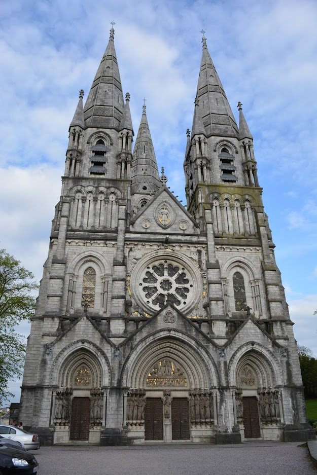
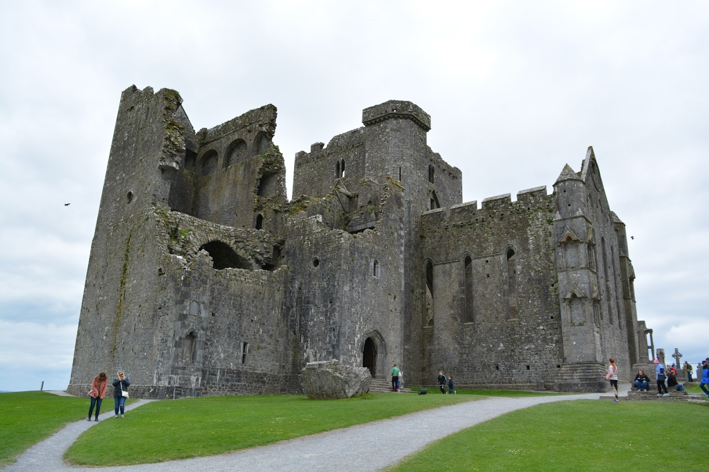

# Cork

If I'm to be completely honest, I didn't really Cork. When we got here we've alreay been to Galway and Killarney so we were used to a beautiful and lighten up Ireland. Cork is a grey city with not much to offer. I hope I'm offending anyone :/ it was just my impression and I admit it may have been my fault.

We stayed here because it was near the Rock of Cashel and we needed some place to spend the night before going to our final destination, which was right back where we started: Dublin. If I'd do it again I wouldn't have spent the night in Cork but in Kilkeny, which is a small town midway between Cork and Dublin and a 50 minutes drive away from Cashel Rock.

Nevertheless, as all cities, there are things to see here if you get the time. Unfornunately, we were only in town for a few hours so we weren't able to visit any sights. If you do have the time, I highly advise the Saint Fin Barre's Cathedral from the nineteenth century.

Walking around the city you will find the National Monument on the Grand Parade as well as the remains of a thirteen century medieval city wall.

## Rock of Cashel
This is, alike [Blarney Castle](trips/13-04-2017-Killarney.md#blarney-castle), a must see. The castle is in ruins but there is still a lot to see there. According to the myth, the rock of cashel (the actual piece of mountain where the ruins stand) was part of another nearby mountain that the devil bit.

The Rock of Cashel is not just a castle but a set of medieval buildings, such as a library and a chapel.

__Guided tours__

We didn't know we could have a guided tour before we arrived. We had to wait a bit for one but it was worth the wait. The guide was superb and we really learned a lot more than we would have otherwise.

I honestly don't remember how long exactly we had to wait for the tour, but I've read [online](http://www.heritageireland.ie/en/south-east/rockofcashel/) that they happen every hour, on the half hour and that they are needed in order to visit Cormac's Chapel.

__How to buy tickets__
You currently have to buy tickets onsite. We didn't find this to be an issue, but if you go there in the Summer months it may be troublesome as this is one of the most (if not the most) visited sights in Ireland.

The opening hours depend on the month of the year so it's better to check [online](https://www.cashel.ie/rock-of-cashel/).

__How long to spend here__
We spent around 2 hours here, from the beginning of the tour, which lasted about 1 hour.