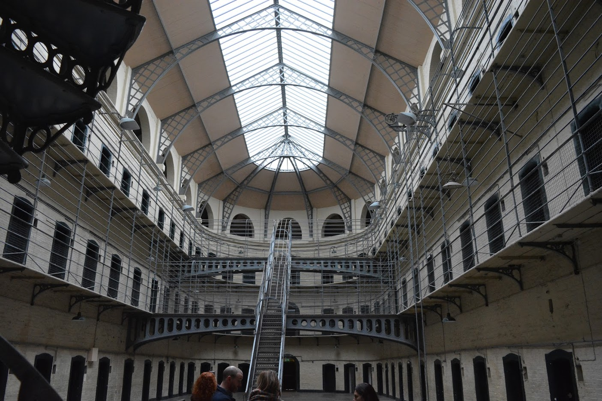
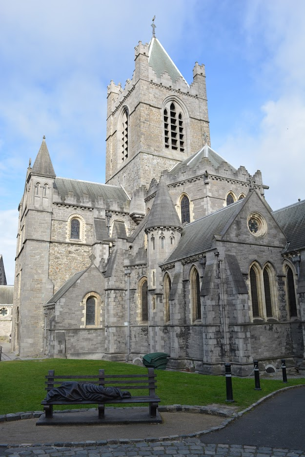
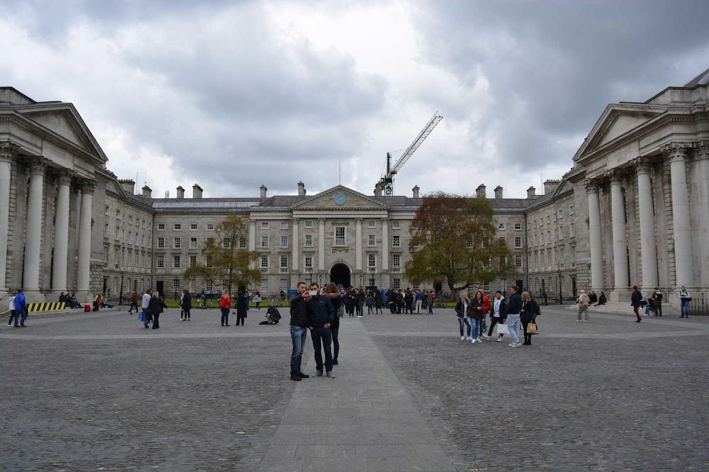
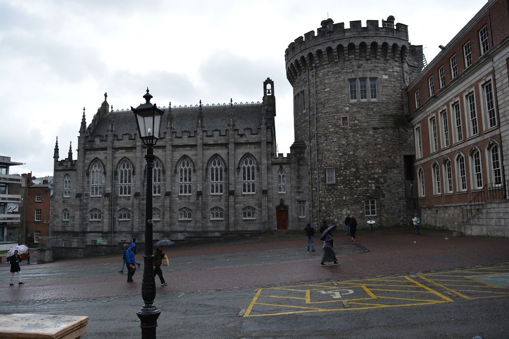
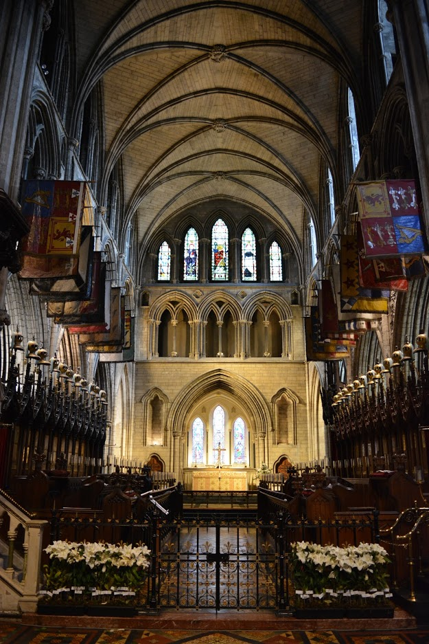
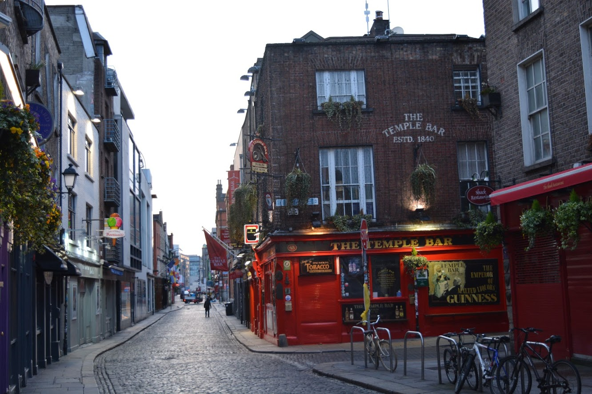
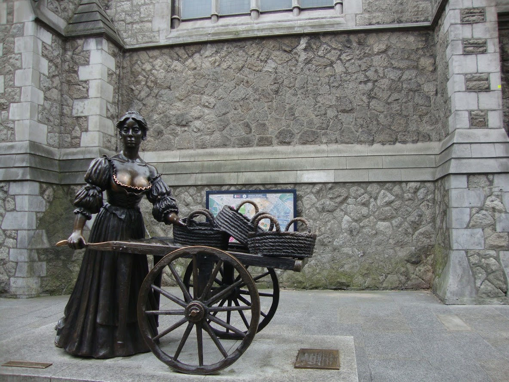

# Dublin
As any other capital in the World, Dublin has a lot of things to do/visit.

## [Kilmainham Gaol](http://kilmainhamgaolmuseum.ie/)
This is an old prison that stayed in Ireland history because it housed many famous figures in the fight for Irish independence, including Thomas Francis Meagher and James Connolly. It was also the site for several executions and hangings.

As in any visit to an old prison, the athmosphere is a bit heavy. But it's totally worth it. Don't worry, you won't feel sick even if you're quite sensitive. Nevertheless, get ready for some shocking stories.

__How to get there__

You can either take a Bus (13, 40, 69 or 79) or a Luna Tram red line and get out at Suir Road.
We took the tram but it crashed mid way. We had to semi-walk/semi-run the rest of the way (almost 30 minutes) and almost didn't get there in time for the tour.

__How to buy tickets__

You must book online. And make sure you do so in advance. A month and a half before we went there were already some sold out slots. We ended up booking with a week in advance and almost all the slots were sold out. You can buy the tickets [here](http://kilmainhamgaol.admit-one.eu/index.php?s=OPW_KILM&p=calendar&ev=TOUR&language=ENG) and they cost about 8€ p.p. plus 1€ (total) for booking fees.

It only closes on 24, 25 and 26 of December. It's schedule depends on the month you visit, so it's best to check the [website](http://kilmainhamgaolmuseum.ie/plan-a-visit/).

__Guided tour__

The only way to visit Kilmainham Gaol is through a guided tour. When you buy the ticket online you must select the day and time slot.
The tour takes 1h but you should allocate 90 minutes as there is a small museum at the end. Remember to get there with 15 minutes in advance.

## [Christ Church Cathedral](https://christchurchcathedral.ie/)
This is one of the most iconic churches in ireland. It's extremelly beautiful and very well maintained. I really enjoyed going there.

__How to get there__

If you're staying near Temple Bar it's a short walk (about 5 minutes on foot). Otherwise, there are several transportation you can take as you can check [here](https://christchurchcathedral.ie/visit-us/getting-there/).

__How to buy tickets__

You don't need to buy the tickets in advance. However, uou can buy them [online](https://www.mytoptickets.com/?3B041324-155D-D234-0AA684C0D2E68919) if you wish to do so. The entrance fee is 7€ or 11€ depending on whether you want a guided tour.

The tickets are valid for a whole year.
The opening times depend on the day of the week so it's always better to check [online](https://christchurchcathedral.ie/visit-us/opening-hours/).

It's possible to buy a combination ticket that includes the Dublina museum for 15€.

__Guided tour__

There are guided tour in specific schedules and they last about 1 hour. You don't specify that schedule when you buy the ticket, you have to be there at the time of the tour and wait for a vancany. A guided tour is the only way to have access to the belfry.

## [Dublinia](https://www.dublinia.ie/)
It's a fun museum to which you should only go if you have the time or if you have kids. The kids will love it. It's well organised and with a lot of information so even adults can enjoy it, but it's definitely not a must.

__How to get there__

It's right next to the [Christ Church Cathedral](#christ-church-cathedral), with only a "bridge" separating them.

__How to buy tickets__

The entrance fee is 10€ or 15€ for a combination ticket with the Chirst Church Cathedral. You can buy the tickets [online](https://www.mytoptickets.com/?08F8E24D-155D-D234-0A0D0FDA926836EC) but honestly there's no need to do so.

The opening times depend on the month of visit, so it's better to check their [site](https://www.dublinia.ie/plan-your-visit/opening-times/). The visit lasts about 90 minutes.

__Guided tour__

They offer (yes, it's an offer) one guided tour a day at 2:30 pm (except on July). I didn't take it so I can't comment on its quality.

## [Trinity College](https://www.tcd.ie/visitors/)
It's one of the highest respected universities in the world and it's surely worth a visit. And not only for the famous Book of Kells (though that's also a must).

__How to get there__

It's right at the heart of Dublin,k at the end of Dame Street.

__How to buy tickets__

There is no entrance fee for the campus. However, the entrance fee to see the Book of Kells (as welll as the rest of the library) is 13€. You can acquire them [online](https://www.tcd.ie/visitors/book-of-kells/tickets-information/?panel=tickets) but you won't get the discount offered by the guided tour. On the other hand you'll be able to enjoy the fast track lane (the normal one is quite slow, trust me).

The opening hours depend on the day of the week and on the month, so it's better to check [online](https://www.tcd.ie/visitors/book-of-kells/tickets-information/?panel=tickets).

__Guided tour__

The tour is made by a student oficially prepared for it and it takes 35 minutes. I think it's a pitty coming here and not taking it.
It can't be booked online, only on site, near the front gate, and it costs 6€ or 15€ if you wish to include the access to the Book of Kells (it's not part of the tour and you'll have to go to the slow line). If you already bought the Book of Kells online you can buy the tour for 4€ (so in fact you'd be paying 2€ for access to the fast track, take it!).

We opted to pay the 15€ (we hadn't bought the Book of Kells ticket yet) and we almost couldn't see the Book as we didn't have time to enter the library (sloooow queue) as we still wanted to visit the Dublin Castle. Luckily, we were able to see it when we came back to Dublin at the end of the trip (the tickets were still valid).

The schedule depends on the month of the visit so it's better to check [online](https://www.tcd.ie/visitors/tours/).

## [Dublin Castle](dublincastle.ie)
It wouldn't be Ireland if there wasn't a castle :D And this one. unlike many others, is in great conditions. You can learn about a time before Ireland became a Republic.

__How to get here__
The center of Dublin is quite small, so it you're near one thing you're near everything (the exception goes to [Kilmainham Gaol](#kilmainham-gaol)). Regardless you can find its precise looking on their [site](http://www.dublincastle.ie/how-to-find-us/).

__How to buy tickets__
The admission fee is 8€. When I visited it wasn't possible to buy the tickets online and we had no problems getting a tour. However, you can [prebook it](https://dublincastle.admit-one.eu/?&language=ENG) if you wish to be on the safe side.

The opening hours are from 9:45 to 17:45 and it closes on 25, 26 and 27 of December and on January, 1.

__Guided tour__
You can join a guided tour for 12€ (admission fee already included) and I highly recommend it. It takes 60 minutes and it includes the State Apartments, Medieval Section and Chapel Royal. Again, when I visited it wasn't possible to buy the tickets online and we had no problems getting a tour. However, you can [prebook it](https://dublincastle.admit-one.eu/?&language=ENG) if you wish to be on the safe side.

## [St Patricks Cathedral](https://www.stpatrickscathedral.ie/visit/)
Even though it's the seat of the bishop, the Church of Ireland considers St. Patrick's Cathedral as the country's national cathedral. It's the tallest chruch (not cathedral) of Ireland and its most famous office holder was Jonathan Swift, the author of *Gulliver's Travels*. It's currently still a working church.

__How to get there__

It's a 10 minute walk from the city center, at the junction of Patrick Street and Upper Kevin Street. There are several buses that stop right next to it. The closest lua stop is St. Stephen's Green, 10 minutes on foot away.

I would say go on foot and enjoy the view.

__How to buy tickets__

Tickets can be bought on site for 8€ or [online](https://stpatrickscathedral.digitickets.co.uk/event-tickets/6314?catID=5860&) for 7.5€. When buying online you have to select the half an hour slot in which you wish to enter. There is no need to book online (except for the 0.50€ saving) as there are actually no lines (at least there weren't when I was there).

The opening times depend on the month of the year so it's better to check [online](https://www.stpatrickscathedral.ie/visit/).

__Guided tour__

There are no guided tours. However, there is an audio guide available, which I highly advise.

## Other places to visit in Dublin
There are a ton of bars in Dublin but the most famous one is definitely the *Temple Bar*. You'll see its name written in several places but there's only a real one (will the real Temple Bar please stand up?).

At night it's quite impossible to stay inside, but I think it's a must to at least check it out. I honestly don't drink and no one in my group (we were five while in Dublin and then got reduced to 2) is a heavy drinker. But we had to check it out. Afterwards, we went to another bar where we could find a place to sit and drink a Pint (at least the rest of the group did).

There are obviously a lot more to see in Dublin. For instance, three of the four sections of the [National Museum of Ireland](https://www.museum.ie/Home) are in Dublin and it's free.

You should also check out the Molly Malone Statue.

