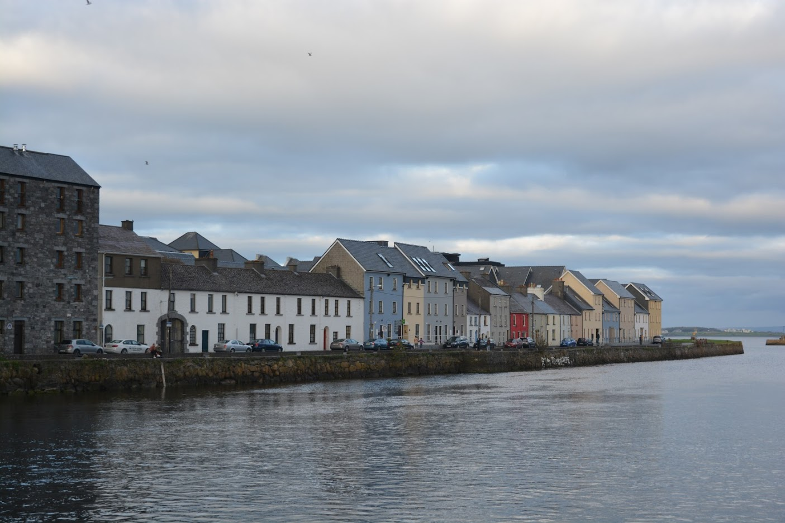
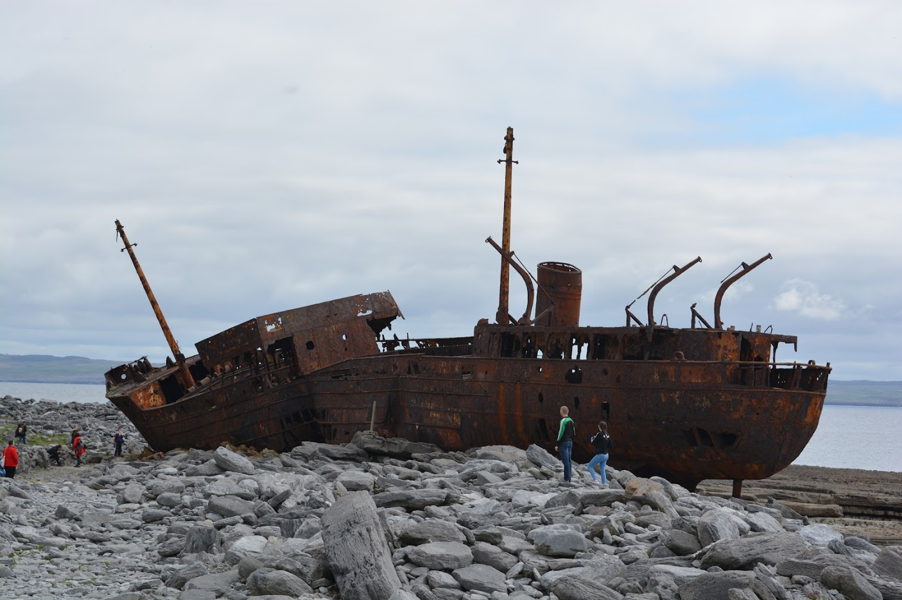
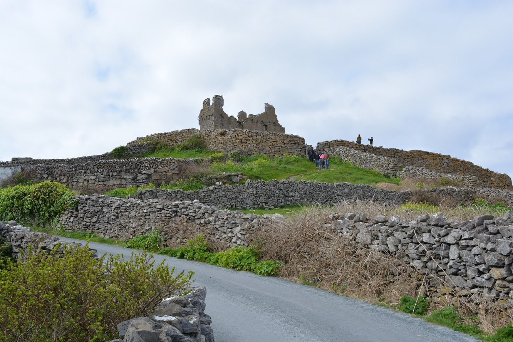
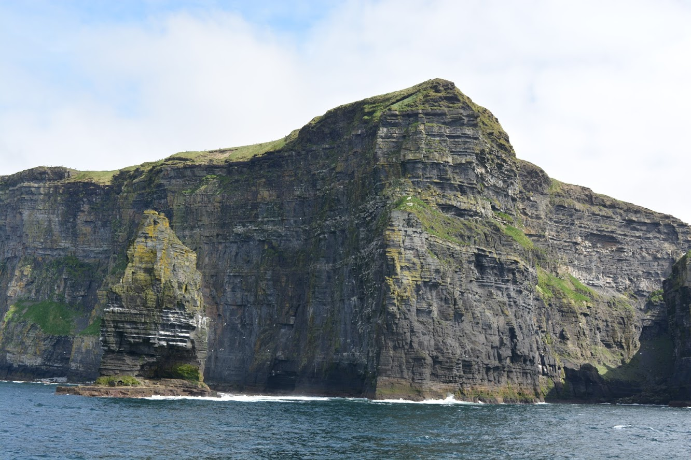
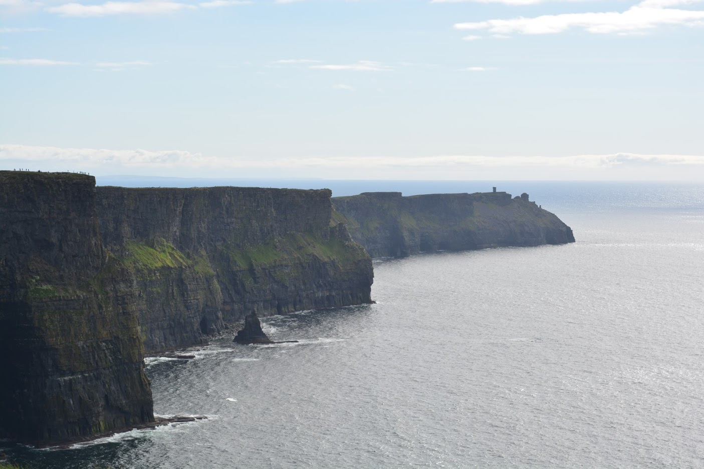

# Galway
If you draw an horizontal line from Dublin to the West, you will find Galway at the end of the main isle of Ireland.

There is a highway connecting Dublin to Galway so it's pretty straightforward. The only trouble we had is that it was the first time we were driving on the "wrong" side of the road so it took a bit to get used to it. The thing was that right at the beginning of the highway there were several exits so we ended up getting out of the highway several times before we actually started xD

## The city
The city itself is actually very cute. It's small so it's quite easy to walk around on foot. We parked our car near the accommodation and only picked it up again when it was time to leave.

There isn't much to see in the city but taking a walk along the river is quite lovely as the views are beautiful.

The main reason people stay at Galway is that it works great as a resting point while visiting its surroundings, namely, of course, the Cliffs of Moher.

## Cliffs of Moher
There is only one word to describe them: stunning!

We booked a tour (we asked at the hotel's reception and checked online for reviews) that would take us there from Galway. The tour included going to the Aran island to the west and, when coming back, going close to the cliffs so everyone could see them. Afterwards, we went to the top of the cliffs where we walked along them and saw an exhibition about them. As the boat doesn't leave straight from Galway the tour starts with a bus taking you from Galway to the coast.

**10:00** get on the bus

**11:30** arrive at the coast

**12:30** dock at Aran island, where we could walk around and have lunch on our own

**14:30** get back on the boat

**15:30** get near Cliffs of Moher

**17:30** get to the top of the cliffs (back on the bus to go there)

**20:00** everyone back on the bus again

### Aran Island
The Aran island is very pretty and it's actually bigger than it seemed. One thing I didn't do and that I'd advise everyone to do is renting a bike. With it you can see the whole island without any worries about the time. We didn't do this and by the end we had to haste (all because I trusted the sense of direction of my boyfriend xD). There are a few things to see on the island and there are some maps pointing you in the right direction. It has everything: a small village with small cottages by the dock, a small castle in ruins, fields with cows (it's Ireland afterall), a beach where people were actually bathing in April (we were wearing our winter jackets...) and a ship wreckage.

### Cliffs of Moher
**From the water**

After leaving the island, the boat started going towards the cliffs. We actually got pretty close to them. It's marvellous. The height, the people the size of ants walking on top of them, and to think it's all Nature.

If you zoom in on the picture, you can actually see the people up on the hill. Yes, those little spots you can hardly see, those are people. So now you get an idea of the size of the Cliffs.

_A word of advice_: if you have a tendency to feel sea sick it's better to take a pill before getting on the boat (at least on the way back) and don't turn your back to take a picture. I have one and only one picture of my boyfriend with his back to the cliffs as the next second he was seating and wishing he wouldn't throw up. Luckly he'd already taken my picture :D

**From the land**

After docking the boat we got back on the bus and drove to the top of the cliffs. It's possible to walk along the cliffs and it's completely safe. Of course this depends on the people, as we saw more than one person leaving the path to get nearer the cliff because it would make a better picture (and the original path is already quite near the cliff). So, it all depends on your sense of responsibility. But it's completely safe, there is no chance of falling down and there's absolutely no problem with taking kids there.

Before we left the bus the driver told us the hour to group up again and said there could be no delays over 5 minutes. Why? You'd think it was a matter of schedule. But no. Apparently, there are too many people that go up there to commit suicide. So whenever someone is unaccounted for, the authorities call a search party. If in the end you were fine and just late you'll have to pay for the all costs. So, don't be late getting back to the bus.

And of course, there is a small castle on top of the cliffs, where you can find a small exhibit.