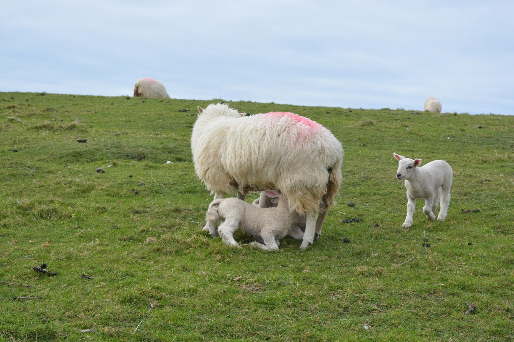

# 11 Days around Ireland (including 1 day Northern Ireland)

On April 2017 my boyfriend and I decided to make a road trip throughout Ireland. We spent 11 days there divided by 3 in Dublin, 1 in Northern Ireland and 7 going from Galway to Dublin through the South.

One thing that stuck with us was the amount of green and of stunning views present wherever you are. You may just be driving around and you'll feel the need to stop and enjoy the view (and take a photo). 

Trust me, don't count the hours to get to wherever you want to go. Just take your time and enjoy the country. This isn't a trip to rush and trust me you won't feel the need to do regardless of the amount of things we wish to cram into the amount of days we have available.

One of the great aspects of going in April is that it's calving season. If you enjoy lamb then it's perfect. If you only like to watch them, it's even better.

I hope this helps you organise your own trip through this AMAZING country.

## How long you should go
There is always one answer to this question, it depends :D

If you absolutely want to visit Dublin, I think 3 whole days is the perfect amount of time. We stayed two whole days but in one of them we toko a one day tour to Norhtern Ireland and we were able to enjoy Dublin in three other half days, so around 4 days in total :D and I think it was the perfect amount of time.

However, I'd recommend against only visiting Dublin. If you're from Europe skip it all together if you have time constraints and just visit the country. It will be easy to find a long weekend to come and visit Dublin with a cheap flight.

One week is the perfect amount of time to visit the south part of the country. We spent 7 days from Dublin to Dublin. It would be possible to shorten it by a day but not more than that.

If you want to visit Northern Ireland than you should probably add another week to your calculations. Or do it like we did and take a day tour from Dublin into the North and have just a taste.

## How to get around in Ireland
It depends where you want to go. Within Dublin the [tram system](https://www.dublinpublictransport.ie/dublin-trams), they call it LUNA,  is quite good and it takes you almost everywhere. **DO NOT** (and I really mean it) think of renting a car while in Dublin. It's really messy and you'll end up just getting stuck in transit.

On the other hand, **once you leave Dublin you really ought to rent a car**. It's really easy. Just go to any of the car rental services. You can find them in several places, being the easiest one the airport itself. The pick up point is actually pretty close to the airport (and to the highway) and so you don't even need to enter Dublin to start your trip.

**Be careful about the toll payment!** If you go on the M50 highway (which you will if you go from Dublin to Galway or the other way around), you have to pay a toll. It gets assigned to the car's registration number and you will pay a fine if you don't pay up (the rental company will make sure you do). The rental company will give you all the information you need, which will be this website: [Toll Payment for Rental Cars](https://www.eflow.ie/help-guidance/faqs/my-journey/how-can-i-pay-the-m50-tol-2/).
**You have to pay until 8pm of the day following your journey.**

## How to get to Dublin city centre from the airport (and vice-versa)
There are several [shuttle companies](https://www.dublinairport.com/to-from-the-airport/by-bus/dublin-buses) that can take you. We used the Airlink Express and bought the tickets at the airport.

## Expenses
Ireland is not a cheap country. We spent around 2700€ for 11 days (two people), which included:
* Accommodations: 900€ (some included breakfast)
* Car Rental: 344€ through Budget Rent for 7 days (Sunday to Saturday) for a Seat Ibiza (including the car insurance with everything)

## Our Itinerary
In April 2017, we took a road trip around Ireland. We visited Dublin for 4 days as a family of 5 and then my boyfriend and I stayed for one more week and took a road trip around the bottom half of Ireland.

This was our itinerary:

Day 1 - Arrival at Dublin. Visit [Dublin](trips/13-04-2017-Dublin.md) during the afternoon: [Kilmainham Gaol](trips/13-04-2017-Dublin.md#kilmainham-gaol)

Day 2 - Visit [Dublin](trips/13-04-2017-Dublin.md): [Christ Church Cathedral](trips/13-04-2017-Dublin.md#christ-church-cathedral) and [Dublinia](trips/13-04-2017-Dublin.md#Dublinia) in the morning, [Trinity College](trips/13-04-2017-Dublin.md#Trinity-College) and [Dublin Castle](trips/13-04-2017-Dublin.md#dublin-castle) in the afternoon

Day 3 - Day tour to [Northern Ireland](trips/13-04-2017-Northern-Ireland.md): Visit [Belfast]trips/(13-04-2017-Northern-Ireland.md#black-taxi-tour), [Giant's Causeway](trips/13-04-2017-Northern-Ireland.md#giants-causeway) and [Carrick-a-Rede bridge](trips/13-04-2017-Northern-Ireland.md#carrick-a-rede-bridge)

Day 4 - Walk around [Dublin](trips/13-04-2017-Dublin.md) in the morning. Rent car and drive to [Galway](trips/13-04-2017-Galway.md): walk around Galway

Day 5 - Day tour to [Cliffs of Moher](trips/13-04-2017-Galway.md#cliffs-of-moher)

Day 6 - Drive to [Limerick](trips/13-04-2017-Limerick.md) (visit the castle). 
Road trip around [Dingle Pensinsula](trips/13-04-2017-Killarney.md#dingle-peninsula). Drive to [Killarney](trips/13-04-2017-Killarney.md).

Day 7 - Road trip around the [Ring of Kerry](trips/13-04-2017-Killarney.md#ring-of-kerry). Visit [Muckross House](trips/13-04-2017-Killarney.md#muckross-house). Overnight at Killarney

Day 8 - Visit [Killarney's Cathedral](trips/13-04-2017-Killarney.md#saint-marys-cathedral). Visit the [Blarney Castle](trips/13-04-2017-Killarney.md#blarney-castle). Overnight at Killarney

Day 9 - Visit [Rock of Cashel](trips/13-04-2017-Cork.md#rock-of-cashel). Drive to Cork. Walk around [Cork](trips/13-04-2017-Cork.md)

Day 10 - Drive to [Kilkenny](trips/13-04-2017-Kilkenny.md) (quick visit). Drive to Dublin: Book of Kells at [Trinity College](trips/13-04-2017-Dublin.md#Trinity-College)

Day 11 - Visit [Dublin](trips/13-04-2017-Dublin.md) in the morning: [St. Patrick's Cathedral](trips/13-04-2017-Dublin.md#st-patricks-cathedral). Fly back to Porto, Portugal

Of course a lot was left undone, but we always goood to have an excuse to come back in the future :D I must add that having been there in late April the days were already quite long and at 8 or 9 pm the sun was still up.

By the way, if you're wondering if **you should take your kids here**, the answer is yes. It's quite a children friendly trip.

We absolutely loved Ireland. And we left knowing that we need to go to Scotland in the future :D

## What I would have done differently
I would have skipped Cork altogether. It's a gray city without anything to show for it and I really didn't like it (I don't mean to offend anyone, it's just my opinion :D). Instead of Cork, on my way to Dublin, I would have stayed in Kilkenny, which was a small but pictoresque town.
