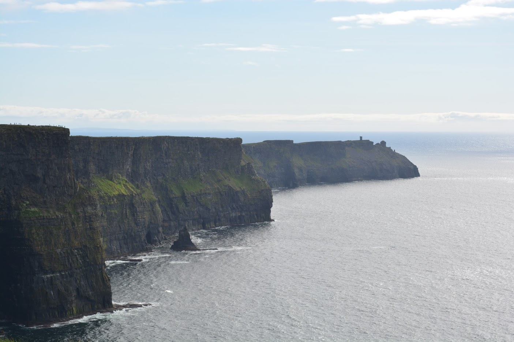

# 11 Days around Ireland (including 1 day Northern Ireland)

On April 2017 my boyfriend and I decided to make a road trip throughout Ireland. We spent 11 days there divided by 3 in Dublin, 1 in Northern Ireland and 7 going from Galway to Dublin through the South.

I hope this helps you organise your own trip through this AMAZING country.

## How to get around in Ireland
It depends where you want to go. Within Dublin the [tram system](https://www.dublinpublictransport.ie/dublin-trams), they call it LUNA,  is quite good and it takes you almost everywhere. **DO NOT** (and I really mean it) think of renting a car while in Dublin. It's really messy and you'll end up just getting stuck in transit.
On the other hand, **once you leave Dublin you really ought to rent a car**. It's really easy. Just go to any of the car rental services. You can find them in several places, being the easiest one the airport itself.

## How to get to the city centre from the airport (and vice-versa)
There are several [shuttle companies](https://www.dublinairport.com/to-from-the-airport/by-bus/dublin-buses) that can take you. We used the Airlink Express and bought the tickets at the airport.

## Expenses
Ireland is not a cheap country. We spent around 2700€ for 11 days (two people), which included:
* Accommodations: 900€ (some included breakfast)
* Car Rental: 344€ through Budget Rent for 7 days (Sunday to Saturday) for a Seat Ibiza

## Our Itinerary
In April 2017, we took a road trip around Ireland. We visited Dublin for 4 days as a family of 5 and then my boyfriend and I stayed for one more week and took a road trip around the bottom half of Ireland.

This was our itinerary:

Day 1 - Arrival at Dublin. Visit Dublin: [Kilmainham Gaol](trips/13-04-2017-Dublin.md#kilmainham-gaol)

Day 2 - Visit Dublin: [Christ Church Cathedral](13-04-2017-Dublin.md#christ-church-cathedral) and [Dublinia](13-04-2017-Dublin.md#Dublinia) in the morning, [Trinity College](13-04-2017-Dublin.md#Trinity-College) and [Dublin Castle](13-04-2017-Dublin.md#dublin-castle) in the afternoon

Day 3 - Day tour to [Northern Ireland](13-04-2017-Northern-Ireland.md): Visit [Belfast](13-04-2017-Northern-Ireland.md#black-taxi-tour), [Giant's Causeway](13-04-2017-Northern-Ireland.md#giants-causeway) and [Carrick-a-Rede bridge](13-04-2017-Northern-Ireland.md#carrick-a-rede-bridge)

Day 4 - Visit Dublin. Rent car and drive to [Galway](13-04-2017-Galway.md): walk around Galway

Day 5 - Day tour to Cliffs of Moher

Day 6 - Drive to Limerick (visit the castle). Drive to Killarney (with several stops for pictures)

Day 7 -  Road trip around Dingle Pensinsula

Day 8 - Visit Blarney Castle

Day 9 - Visit Cashel Rock. Drive to Cork. Visit Cork (TODO)

Day 10 - Drive to Kilkenny (quick visit). Drive to Dublin: Book of Kells at [Trinity College](13-04-2017-Dublin.md#Trinity-College)

Day 11 - Visit Dublin: [St. Patrick's Cathedral](13-04-2017-Dublin.md#st-patricks-cathedral). Fly back to Porto, Portugal

Of course a lot was left undone, but we always goood to have an excuse to come back in the future :D

By the way, if you're wondering if you should take your kids here, the answer is yes. It's quite a children friendly trip.

## What I would have done differently
I would have skipped Cork altogether. It's a gray city without anything to show for it and I really didn't like it (I don't mean to offend anyone, it's just my opinion :D). Instead of Cork, on my way to Dublin, I would have stayed in Kilkenny, which was a small but pictoresque town.
