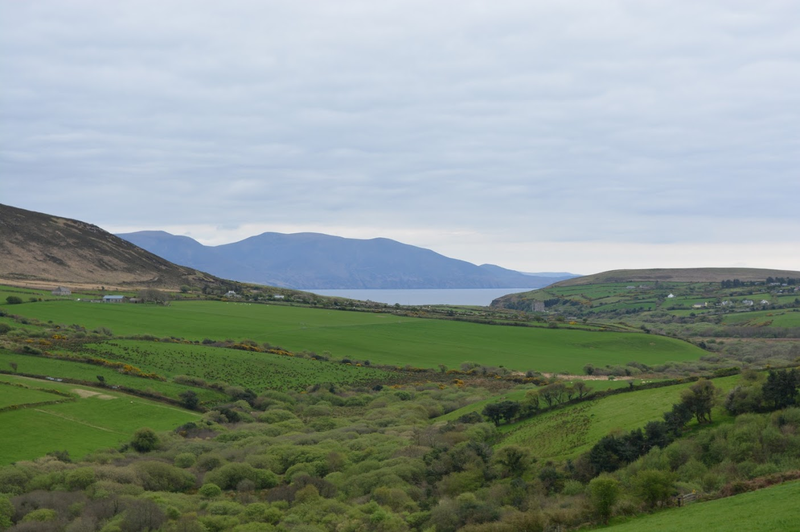
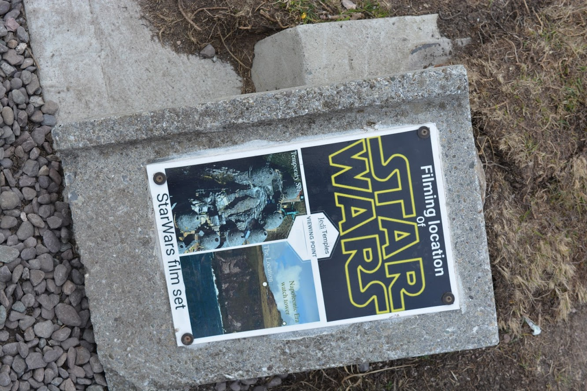
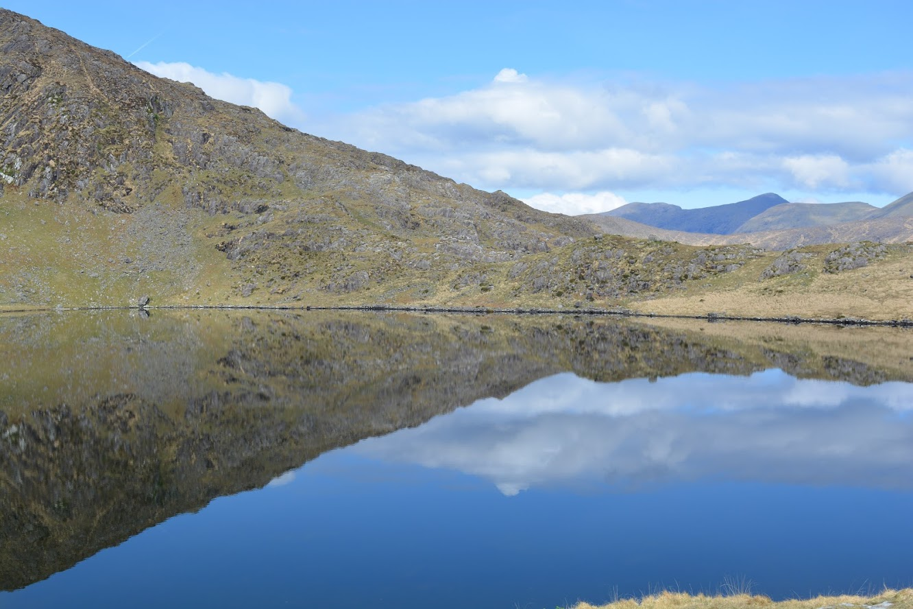
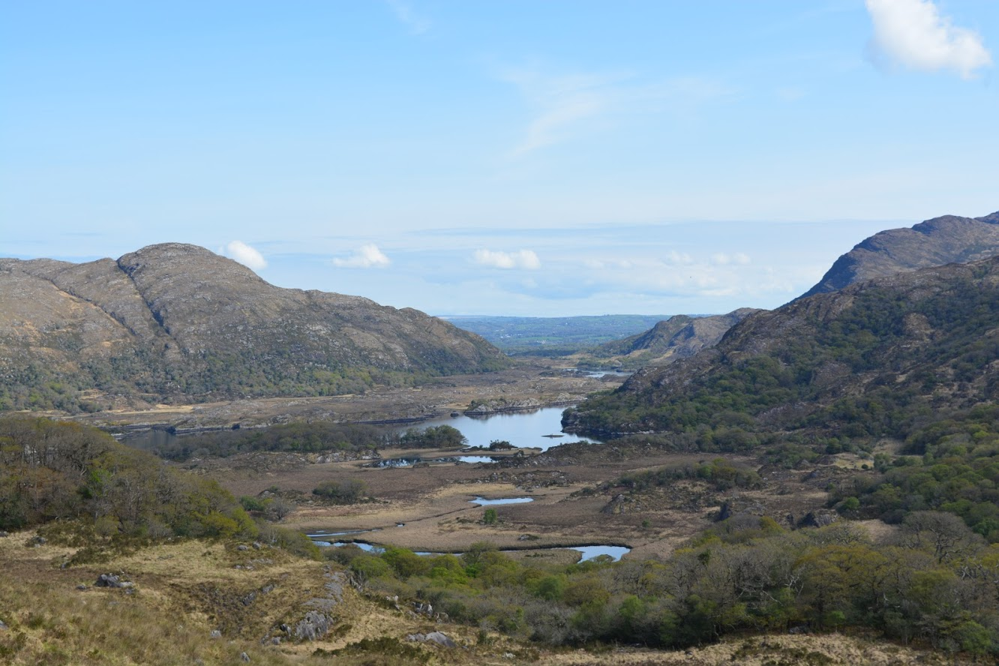
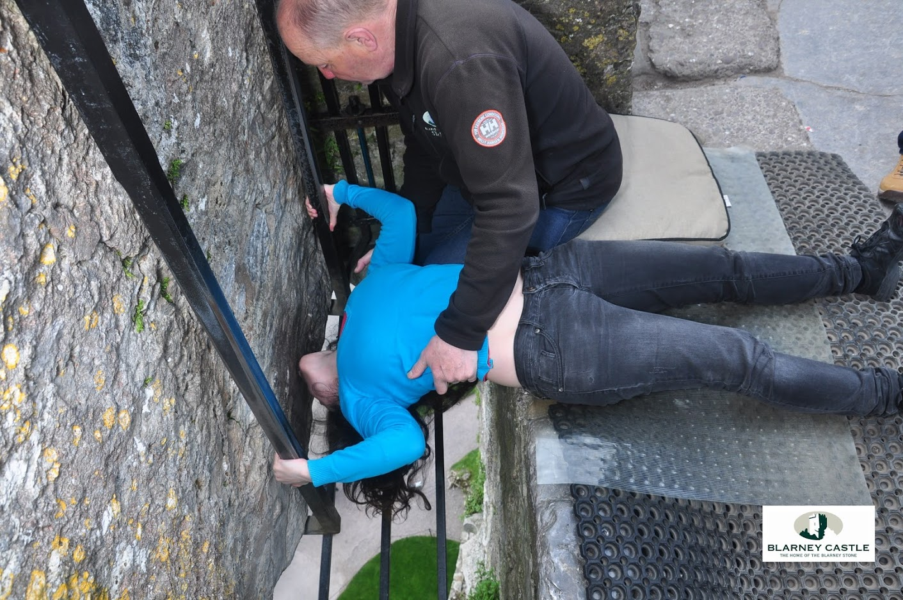
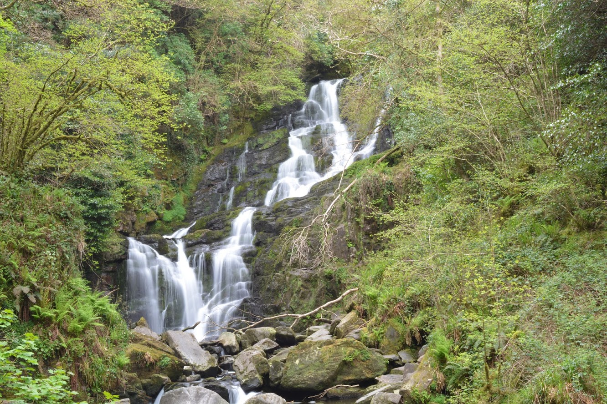

# Killarney

Two of the most beautiful circuits to make in Ireland are the Dingle Peninsula and the the Ring of Kerry. Killarney is a small and pictoresque city where many people, including us, stay overnight when they want to visit them.

Both the Dingle Peninsula and the Ring of Kerry are, in fact, peninsulas in the southern-west part of Ireland. The Ring of Kerry, however, is much larger than the Dingle Peninsula.

It's also a great origin spot to visit the Blarney Castle and its gardens.

## Dingle Pensinsula
It is a shame not go around the Dingle Peninsula if you come to this part of the island. It presents the most fascinating views, with tons of viewpoints. In fact, there is so little traffic that, as long as you see it's safe, you can park almost anywhere to enjoy the view.

For those of you Star Wars fans, some of the scenes for Star Wars: The Last Jedi were also shot here. For instance, this is where the filmed Rey finally meeting Luke and some of her training. There are actually specific tours you can take that go to the different shooting places (not only at Dingle). Some (I'm not sure if all) of these locations are actualy identified on the spot as you can see in the photo.

As we came here during the calving season, we were able to see several cute little lambs all over the fields. They are adorable, regardless of what they're doing at the moment, be it easting grass, jumping around like crazies or just sucking on their mommy's tits.

__How much time to spend__

It completely depends on how many times you stop along the way and for how long. We left Limmerick at around 4 pm and still had time to visit it (we arrived at Killarney at around 9 pm). Had we more time available we'd have driven around around a bit more, but we honestly didn't feel the need to come back here the next day.

## Ring of Kerry
I have a theory, and being here has only served to prove me right: every natural scenary is even more beatiful if you add water to it.

The views you get at the Ring of Kerry are, simply put, absolutely stunning. I loved both the Dingle Peninsula and the Ring of Kerry, but if you only have time for one of them I think it'd be better to go with the Ring of Kerry. I think I'll leave the photos speak for themselves.

__How much time to spend__

Just like with the Dingle Pensinsula, it completely depends on how many times you stop along the way and for how long. What I can say is that we spent there a bit over one morning.

## Blarney Castle
The Blarney Castle is famous for its Stone of Eloquence. History goes that those who kiss the stone will be blessed with the gift of Eloquence. Whether or not you believe it is irrelevant as, even if you don't intend to kiss the stone, the castle's gardens are enough to fully justify a visit.

Whenever I travel I like to try as much as possible, for the sheer feeling of having done it (of course this isn't always possible, like when my fear of heights takes the best of me). So, I obviously kissed the stone, which was actually a bit of an accomplishment for someone who's afraid of heights.

The gardens surrouding the castle are actally what people should look for when visiting it. They are gorgeous and immense. They even have a small waterfall in their midst.

__How much time to spend here__
The gardens are immense so you can actually spend as much time as you'd like. We spent around 2 or 2 and half hours there. It's always better to check the [opening hours](https://blarneycastle.ie/pages/plan-your-visit) as they've actually changed since I've been there.

__How to buy tickets__
It's now possible to book your tickets [online](https://blarneycastle.ie/tickets) but there's no need for that unless you want the 2€ online discount.