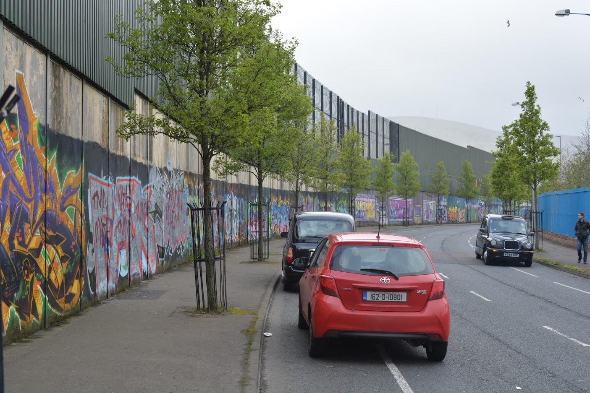
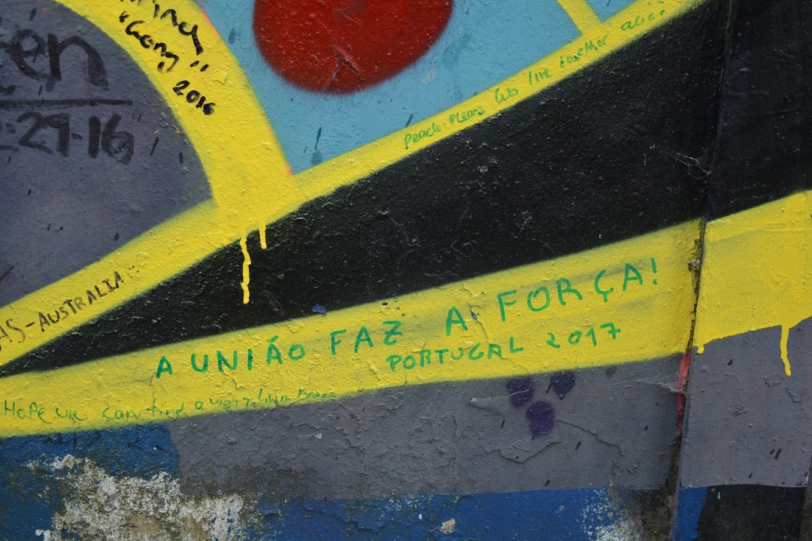
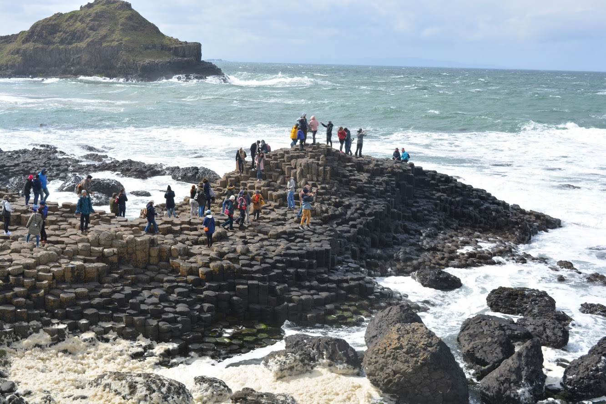
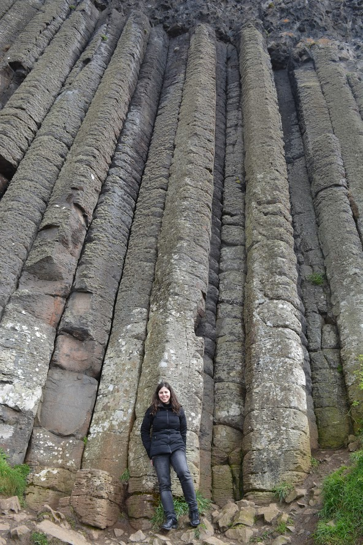
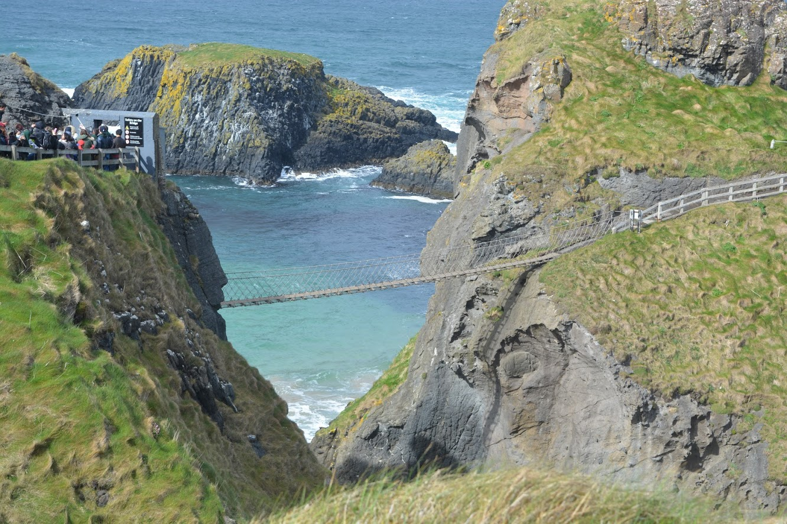

# Day trip to Northern Ireland

We initially thought of adding some days to the visit the Northern Ireland but after asking around in foruns and such we decided it was a bad ideia considering the amount of days we had available.

As such, we thought of participating on a one day tour from Dublin that could give us a taste of what Northern Ireland is like.

We booked it through [Wild Rover Tours](https://wildrovertours.com) for two main reasons: they were highly quoted in [Trip Advisor](https://www.tripadvisor.com/Attraction_Review-g186605-d2091253-Reviews-Wild_Rover_Tours-Dublin_County_Dublin.html) and they offered a quite complete tour (it included a Black Taxi tour in Belfast about the political situation of the country while most other tours were more focused on taking people to the places where Game of Thrones, Harry Potter or other films had been shot). At the time it cost 70€ p.p. and it was worth every penny.

## Our day

**7:00** Meet near Trinity College

**10:30** Arrive at Belfast. Tour separated in two groups: one for the [Black Taxi Tour](#black-taxi-tour) and another to visit the Titanic museum

**12:30** Group up with the rest of the group

**14:30** Arrive at Giant's Causeway (we stopped once along the way for some pictures)

**16:00** Group everyone

**16:20** Arrive at Carrick-a-rede Bridge

**17:45** Meet up next to the bus again

**22:00** Arrive at Dublin

The tour didn't include hotel pick up so we met them near Trinity College at around 8 am. There were a bus driver and a guide, which is great compared to when the same person is responsible for both and you usually end up not having such a great guide as he has to be more focused on the road than on the people.

The guide would talk about historical events that happened in the places where we passed by, which was very interesting. As we weren't stopping at these places he made sure he would explain everything before we passed by so that we could know what we were looking at.

Around 10:30 we reached Belfast and the group was divided in two: some people wanted to visit the Titanic Museum and others (my group included) wanted to take the Black Taxi political tour. When we all got together again the ones that went to the museum said they engjoyed it very much but I can't fanthom why anyone with make such a choice unless they had already done the other tour :D

### Black Taxi Tour
The Black Taxi Tour is something that everyone should do. They divided us into smaller groups so that we could fit in a taxi (each taxi took 5 people). The guide for this part of the tour was the taxi driver. The first challenge was understanding him :D I have studied English for several years and have a quite good ear for understanding different accents and I must say theirs was hard to understand (even worth than the ones from Ireland). However, after five minutes I was already able to follow what they said. My family was not so familiarised with the English language (even though they could follow a converstation) and they were able to understand most of what was being said (if they missed something I'd fill in the blanks).

We drove around Belfast while the driver would explain everything about what we were seeing. At some points we would stop and, together with the people from the other taxis, we'd listen to stories told by people who had lived them first hand. And not just from one side, some were catholics and some were protestants. We also stopped at several locations that were significant to the history of the country (mainly the conflict between the protestants and the catholics).

The one thing that impressed me the most was learning that there currently is a wall separating the city of Belfast in two (does this ring a bell?). I was stunned how this could still be hapenning in Europe after everything we had learned with the Wall of Shame.

People can only go through it in specific checkpoints and only during a certain period of time. If they are late they have to stay at the wrong side of the wall. According to the guide, most people actually prefer to have the wall up as they feel safer, specially for the ones who live near the border. Again, this wall cuts Belfast in half!!!

The graffitis you see in the wall was not vandalism but an attempt to colour the wall. And it's filled with messages from people all around the world. In the next picture you can my own message, which translates to "Unity makes us stronger", it's a phrase that was (and is) widely used in Portugal when fighting fascism.

Nowadays, it's more common for the children/teenagers to be in groups where there are both catholics and protestants, but it's still not well accepted.

### Giant's Causeway

You can't go to Northern Ireland nd not visit the Giant's Causeway (well, of course you can, but it wouldn't be the same now, would it?). It's massive and it's extremelly hard to fanthom how it **isn't** the result of human labour.

When we get there, the bus parks at the top of a hill where the Giant's Causeway Visitor Center stands. You have to walk down the road to get near the sea where you can actually enjoy it.

This part of the tour is not guided, you are free to do as you please. They only give you a return time, by which everyone must be back at the bus.

### [Carrick-a-rede Bridge](https://www.nationaltrust.org.uk/carrick-a-rede)

Next stop is Carrick-a-rede bridge, which is an all rope bridge. And yes, it balances all the way until the end. It was originally built by fishermen as they would use it to fish salmon from the middle of the bridge. It's suspended 30m (100ft) above sea level. 

By the time we got there, I was second guessing my decision to go through it as I have fear of heights and I have already felt what it's like when our legs simply won't move and I knew that once you start there's not going back. What's worst, if you cross it once you have to cross it back again. The views from the other side are supposed to be stunning though.

This time the decision was made by me. It was so windy that the bridge was closed for safety reasons.

## Be aware
There are a few things you should take into consideration when visiting Northern Irelan and, specifically, this tour.

**Weather**

Ireland is a country with around 300 days of rain. Northern Ireland is even worse. So, be prepared for rain and strong wind. We had close to perfect weather in all the 11 days of the trip except on the day we came here. The rain would really hurt our faces and the wind was really strong (in fact, even though we went to carrick-a-rede bridge it was closed for security reasons due to the strong wind).

**Currency**

It's called Ireland but they're not the same country. Northern Ireland belongs to the United Kingdom and thus its currency is pounds. Take some with you as it may come in handy.

**Lunch**

This tour didn't include lunch. We took some sandwiches and ate when we got to Giant's Causeway, before walking down from the parking lot into the causeway itself.

**Carrick-a-rede bridge ticket**

Crossing the bridge depends on the weather conditions. They only let you cross it if it's safe (as it should be). However, the tour price already includes the price of crossing the bridge (9€) and it's not refunded in case we can't (or you won't). Obviously, the decision of whether or not it's safe to cross is not made by the tour guide but by the people in charge of the bridge.